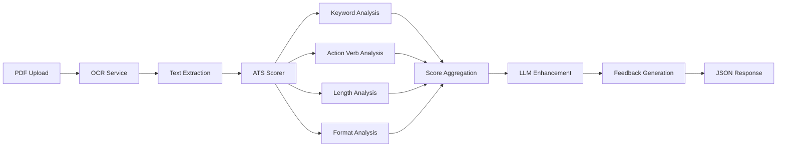

# System Architecture

## Resume Analyzer Architecture Overview

The Resume Analyzer is built as a modular, microservices-inspired Python Flask application with clear separation of concerns.

---

## High-Level Architecture

```
┌─────────────────┐    ┌──────────────────┐    ┌─────────────────┐
│   PDF Upload    │───▶│   OCR Service    │───▶│  Text Analysis  │
│                 │    │  (Azure Doc AI)  │    │   (ATS Scorer)  │
└─────────────────┘    └──────────────────┘    └─────────────────┘
                                                        │
┌─────────────────┐    ┌──────────────────┐    ┌─────────────────┐
│ LLM Enhancement │◀───│ Feedback Engine  │◀───│ Scoring Engine  │
│   (Groq/OpenAI) │    │                  │    │                 │
└─────────────────┘    └──────────────────┘    └─────────────────┘
```

---

## Component Architecture

### 1. **API Layer** (`app.py`)
- **Flask REST API** with CORS support
- **Route handlers** for all endpoints
- **Error handling** and response formatting
- **Health monitoring** endpoints

### 2. **OCR Service** (`ocr_service.py`)
- **Azure Form Recognizer integration**
- **PDF text extraction** with two modes:
  - `prebuilt-read`: Basic text extraction
  - `prebuilt-layout`: Layout-aware extraction
- **Error handling** and service availability checks

### 3. **Scoring System** (`scoring/`)
- **Modular scoring components**:
  ```
  scoring/
  ├── ats_scorer.py        # Main orchestrator (100 points total)
  ├── keyword_scorer.py    # Technical/industry keywords (40 pts)
  ├── actionverb_scorer.py # Action verbs and language (25 pts) 
  ├── length_scorer.py     # Optimal word count (20 pts)
  └── format_scorer.py     # Structure validation (15 pts)
  ```
- **Weighted scoring algorithm**
- **Extensible for new scoring criteria**

### 4. **LLM Integration** (`llm/`)
- **Service abstraction** for multiple LLM providers
- **Structured data extraction** with Pydantic models
- **Intelligence enhancement** for deeper analysis
- **Graceful degradation** when LLM unavailable

### 5. **Feedback System** (`feedback/`)
- **Priority-based recommendations**
- **Template-driven messaging**
- **Category-based feedback** (ATS optimization, career advice, etc.)

---

## Data Flow

### OCR → Analysis Pipeline



### Data Models

#### **Input Models**
```python
# OCR Input
MultipartFile: PDF binary data

# Analysis Input  
ResumeAnalysisRequest:
  resume_text: str
```

#### **Internal Models**
```python
# Parsed Resume Data
ParsedResume:
  contact_info: ContactInfo
  work_experience: List[WorkExperience]
  education: List[Education]
  skills: List[str]
  certifications: List[str]

# Scoring Results
ScoringResult:
  total_score: int
  breakdown: ScoreBreakdown
  details: Dict[str, Any]
```

#### **Output Models**
```python
# API Response
AnalysisResponse:
  score: int
  word_count: int
  breakdown: ScoreBreakdown
  feedback: List[str]
  llm_insights: Optional[LLMInsights]
```

---

## Service Dependencies

### External Services
- **Azure Form Recognizer**: PDF text extraction
- **Groq API**: LLM analysis (optional)
- **OpenAI API**: Alternative LLM provider (optional)

### Service Resilience
- **Graceful degradation**: System works without LLM
- **Health checks**: Monitor external service availability
- **Error handling**: Structured error responses
- **Fallback modes**: Traditional scoring when AI unavailable

---

## Configuration Architecture

### Environment-Based Config
```python
# Required for OCR
DOCUMENTINTELLIGENCE_ENDPOINT
DOCUMENTINTELLIGENCE_API_KEY

# Optional for LLM
OPENAI_API_KEY  
OPENAI_MODEL

# Application settings
DEBUG=False
MAX_TOKENS=1500
TEMPERATURE=0.3
```

### Config Validation
- **Startup validation** for required services
- **Runtime checks** for service availability
- **Graceful degradation** when optional services missing

---

## Security Architecture

### Current Implementation
- **No authentication** (development mode)
- **CORS enabled** for cross-origin requests
- **Input validation** via Pydantic models
- **Error message sanitization**

### Production Recommendations
- **API key authentication**
- **Rate limiting** per IP/user
- **Input sanitization** for uploaded files
- **HTTPS termination** via reverse proxy
- **Secret management** (Azure Key Vault, AWS Secrets Manager)

---

## Scalability Considerations

### Current Architecture
- **Single-threaded Flask** development server
- **Synchronous processing** 
- **In-memory state** only

### Scaling Strategies
- **Production WSGI server** (Gunicorn, uWSGI)
- **Horizontal scaling** with load balancer
- **Async processing** for long-running OCR tasks
- **Caching layer** (Redis) for repeated analyses
- **Queue system** (Celery, RQ) for background processing

### Resource Usage
- **OCR processing**: ~2-3 seconds per PDF
- **LLM analysis**: ~1-2 seconds per request
- **Memory usage**: ~50-100MB base + processing overhead
- **Storage**: Temporary files only (no persistence)

---

## Development Architecture

### Code Organization
```
resume_agent/
├── app.py                 # Flask application entry point
├── config.py             # Environment configuration
├── ocr_service.py        # Azure OCR integration
├── scoring/              # Modular scoring system
│   ├── __init__.py
│   ├── ats_scorer.py     # Main scoring orchestrator
│   ├── keyword_scorer.py # Keyword analysis
│   ├── actionverb_scorer.py
│   ├── length_scorer.py
│   └── format_scorer.py
├── llm/                  # LLM integration
│   ├── __init__.py
│   ├── llm_service.py    # Service abstraction
│   ├── resume_parser.py  # Structured data extraction
│   └── intelligence_enhancer.py
├── feedback/             # Feedback generation
│   ├── __init__.py
│   ├── feedback_generator.py
│   └── feedback_templates.py
├── test/                 # Test files
│   └── document.pdf
├── docs/                 # Documentation
└── requirements.txt      # Dependencies
```

### Testing Strategy
- **Unit tests**: Individual component testing
- **Integration tests**: API endpoint testing  
- **End-to-end tests**: Complete pipeline validation
- **Health monitoring**: Service availability checks

---

## Deployment Architecture

### Local Development
```bash
# Virtual environment
python -m venv .venv
source .venv/bin/activate
pip install -r requirements.txt
python app.py
```

### Docker Deployment
```yaml
# docker-compose.yml
services:
  resume-analyzer:
    build: .
    ports:
      - "5001:5001"
    environment:
      - DOCUMENTINTELLIGENCE_ENDPOINT
      - DOCUMENTINTELLIGENCE_API_KEY
    healthcheck:
      test: ["CMD", "curl", "-f", "http://localhost:5001/health"]
```

### Production Considerations
- **Reverse proxy** (nginx) for HTTPS termination
- **Process manager** (systemd, supervisor) for service management
- **Monitoring** (Prometheus, Grafana) for metrics
- **Logging** (structured JSON logs for aggregation)
- **Backup strategy** for configuration and temporary data